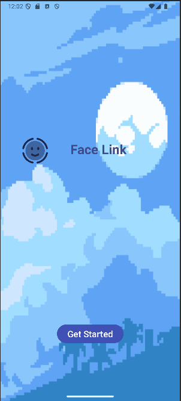
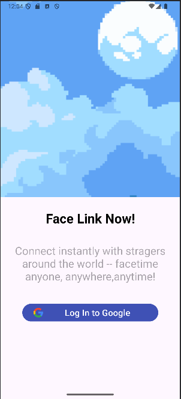
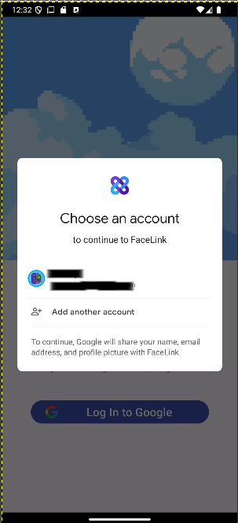
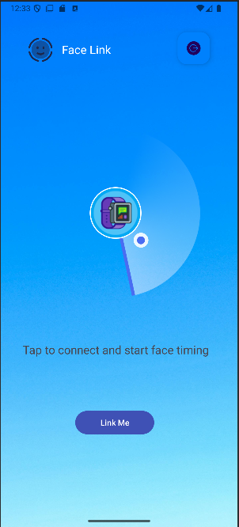
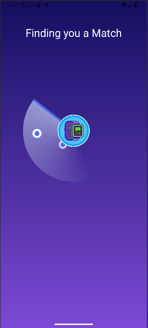
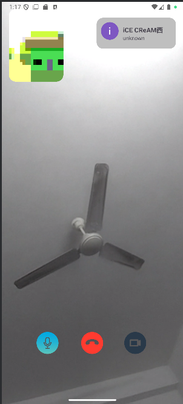

# FaceLink

FaceLink is a random video calling app built using Java and XML, designed to connect users through seamless video communication. Users can set up their profiles, engage in random video calls, and enjoy real-time interactions powered by WebRTC and PeerJS.

# Tecnhologies Used
- Android: Java and XML
- WebRTC: Web Real-Time Communication for video and audio streaming
- Firebase: Authentication, Realtime Database, Storage
- Glide: Image loading and caching library for smooth image rendering


## Table of Contents

- [Installation](#installation)
- [Usage](#usage)

# Installation

Provide step-by-step instructions on how to install and set up your project locally. For example:

- Clone the repository:
```bash
git clone https://github.com/yesheytenzin/FaceLink.git
```
- Open the project in Android Studio.
- Build and run the app on an Android emulator or physical device.
``` bash
# Note: Create your own firebase account in firebase console and change the connection settings incase current config is expired
```


# Usage
- Register a new account or log in with your existing credentials.
- Grant the necessary camera and microphone permissions.
- Start the app and wait for a random video call request or initiate a video call.

``` ```
# App Demo

```     ```

``` ```

```     ```


``` ```

```     ```
